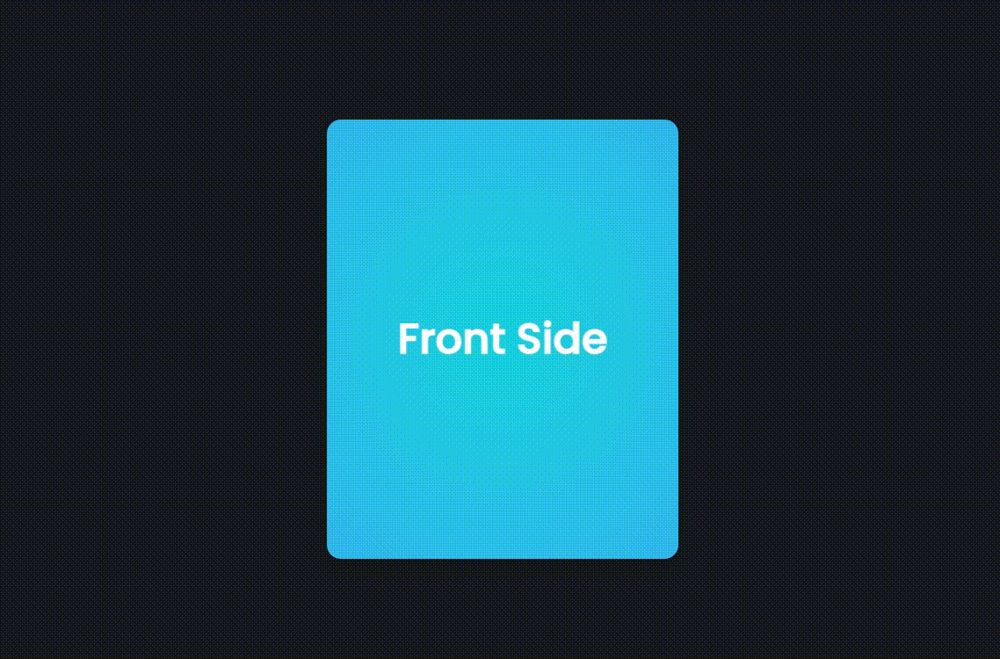

#### perspective: 800px

- 3차원 깊이
- https://developer.mozilla.org/en-US/docs/Web/CSS/perspective

 

#### transform-style: preserve-3d

- 자식 요소들의 배치를 3차원으로 처리
- 현재 예제에서 해당 요소 값(preserve-3d) 제거한 경우 hover시 프론트사이드의 뒷면으로 보임
- https://developer.mozilla.org/en-US/docs/Web/CSS/transform-style

 

#### backface-visibility: hidden;

- 3차원 요소들의 뒷부분 가림
- https://developer.mozilla.org/en-US/docs/Web/CSS/backface-visibility

 

#### 참조

[Julio Github](https://github.com/juliocodes-sm/Reels/tree/main/Cards/04)
